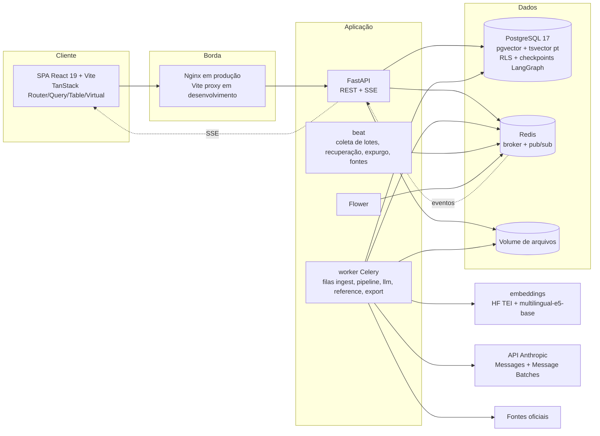
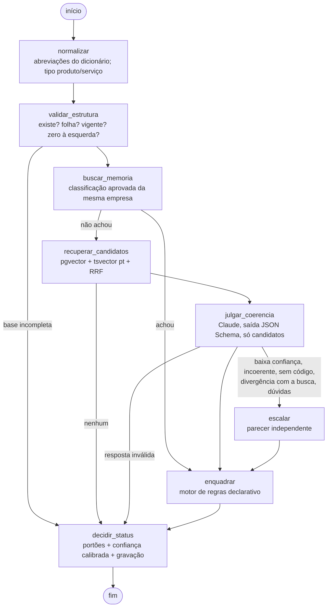
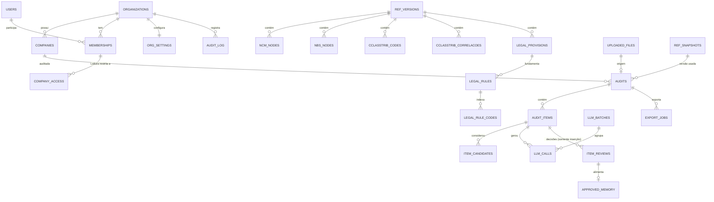

# Arquitetura

## Visão geral



- Um único código de backend (`backend/app`) serve API, worker e beat.
- A chave da Anthropic só existe no servidor (API e worker).
- Progresso em tempo real: o worker publica eventos no Redis; a API os repassa por Server-Sent Events
  (o frontend usa `fetch` com streaming, pois o `EventSource` nativo não envia o cabeçalho de autorização).

## Pipeline de auditoria (LangGraph)

Um grafo por item, com estado tipado (`ItemState`, Pydantic) e checkpoint no PostgreSQL
(`PostgresSaver`). O contexto de execução (snapshot da base, regras, limiares, modelos) é passado
como `context` do LangGraph e reconstruído a cada execução.



**Batch API.** Em auditorias acima do limite configurado, os nós de IA gravam a requisição em
`llm_calls` (status `na_fila`) e chamam `interrupt()`. A tarefa `llm.coletar_lotes` (a cada 30 s)
agrupa por auditoria e modelo, envia o lote, consulta o andamento e, quando termina, **grava cada
resposta antes** de retomar os grafos (`Command(resume=...)`). Na retomada o nó encontra a resposta
gravada e não chama a API de novo.

**Idempotência e retomada.** Cada chamada tem chave `item:<id>:t<tentativa>:<nó>:<modelo>:<prompt>`
(única no banco). Se o worker cair, o Celery reentrega a tarefa (`acks_late`) ou o beat reenfileira o
item; o grafo retoma do checkpoint e a resposta já paga é reutilizada. Isso é coberto por testes.

**Decisão e confiança.** Portões rígidos primeiro (motivos bloqueantes levam à análise humana); depois
a confiança composta (`calibracao.json`): modelo, posição na busca, concordância entre etapas, certeza
da regra, qualidade da descrição e validade do código atual. Mudança de código só vira **Corrigido**
com o segundo parecer concordando. Detalhes em `backend/app/pipeline/decision.py`.

## Modelo de dados



| Grupo | Tabelas | Observações |
|---|---|---|
| Tenancy | `organizations`, `org_settings`, `users`, `memberships`, `company_access`, `companies`, `refresh_tokens`, `notifications` | Usuário pode ter vínculo com várias organizações, com um papel em cada. |
| Base de referência (global) | `ref_versions`, `ncm_nodes`, `nbs_nodes`, `cst_codes`, `cclasstrib_codes`, `cclasstrib_correlacoes`, `legal_provisions`, `legal_rules`, `legal_rule_codes`, `condition_attributes`, `ref_snapshots` | Nunca sobrescrita. `ref_snapshots` fixa as versões e regras aprovadas usadas por uma auditoria. |
| Auditoria | `uploaded_files`, `mapping_templates`, `audits`, `audit_items`, `item_candidates`, `item_reviews`, `approved_memory` | `item_reviews` é somente inserção (gatilho bloqueia UPDATE). |
| IA | `llm_calls`, `llm_batches` | Modelo, versão do prompt, tokens (entrada, saída, cache), custo, latência, request id. |
| Exportação | `export_jobs`, `export_layouts` | |
| Auditoria do sistema | `audit_log` | Somente inserção, encadeado por hash (gatilho `audit_log_encadear`). |

## Isolamento entre tenants

- A aplicação conecta com o papel `reforma_app` (sem `BYPASSRLS`, não é dono das tabelas).
- Cada transação executa `set_config('app.org_id' | 'app.user_id' | 'app.platform_admin', …, true)`
  a partir de `session.info["tenant"]` (evento `after_begin` do SQLAlchemy).
- Todas as tabelas de clientes têm RLS (`ENABLE` + `FORCE`) com `org_id = app_org_id()`.
- A base de referência é escrita somente pelo papel `reforma_ref`, usado apenas nas rotas do
  superadministrador e nos importadores.
- Tarefas agendadas descobrem em quais organizações atuar por funções `SECURITY DEFINER` que devolvem
  apenas identificadores (`sys_orgs_com_trabalho`, ...); o trabalho em si roda sob RLS.
- `tests/test_isolamento_tenants.py` prova: leitura, escrita, atualização em massa e SQL direto não
  cruzam organizações; a API responde 404 para recursos de outro tenant; o log é imutável e encadeado.

## Estrutura do repositório

```
backend/            FastAPI, Celery, LangGraph, SQLAlchemy, Alembic, testes
  app/api/          rotas REST e SSE
  app/pipeline/     grafo, nós, decisão, confiança, contexto, execução
  app/rules/        esquema declarativo, motor, validação, geração oficial, extração assistida
  app/reference/    importadores, busca híbrida, snapshots, embeddings
  app/ingest/       leitura de planilhas, mapeamento, limpeza, estimativa
  app/llm/          gateway, Batch API, preços, orçamento, prompts, esquemas
  prompts/          prompts versionados (nome/vN.md)
  migrations/       Alembic (+ SQL de segurança em migrations/security.py)
frontend/           React 19 + Vite + TS; src/features por tela; src/components/ui (shadcn/ui)
infra/              init do Postgres e scripts
data/samples/       planilhas fictícias e gerador
evals/              conjunto-ouro (formato + exemplo não validado), configurações e relatórios
docs/               esta documentação e ADRs
```
