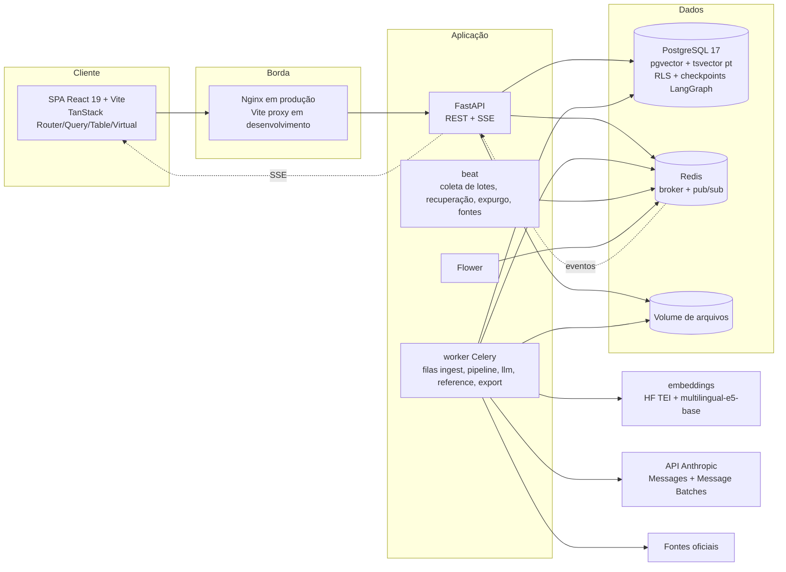
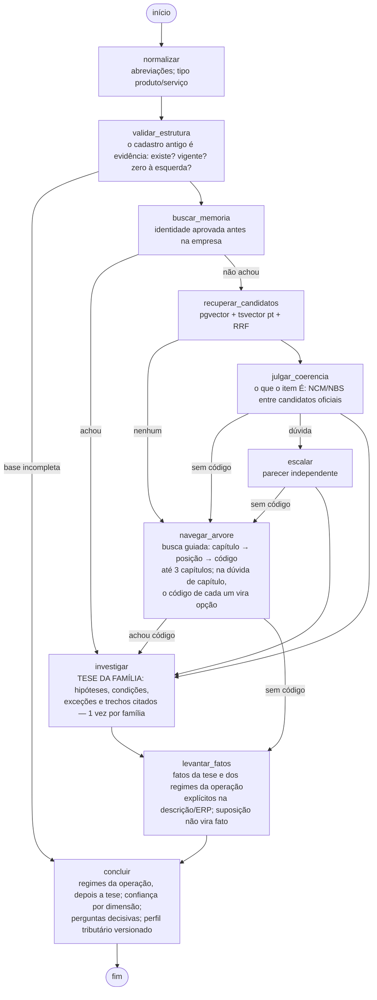
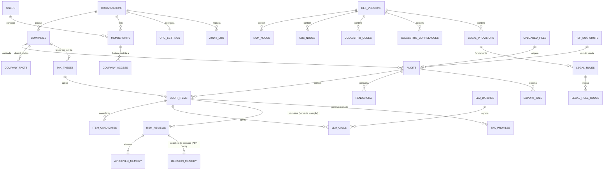

# Arquitetura

## Visão geral



- Um único código de backend (`backend/app`) serve API, worker e beat.
- A chave da Anthropic só existe no servidor (API e worker).
- Progresso em tempo real: o worker publica eventos no Redis; a API os repassa por Server-Sent Events
  (o frontend usa `fetch` com streaming, pois o `EventSource` nativo não envia o cabeçalho de autorização).

## O analista fiscal (LangGraph)

O sistema funciona como um **analista fiscal digital**, não como um conversor de códigos. A unidade de
análise é **item + empresa + operação + data + condições**. A saída (CST/cClassTrib) vem **depois** de um
enquadramento jurídico explicado, nunca direto do NCM.

Um grafo por item, com estado tipado (`ItemState`, Pydantic) e checkpoint no PostgreSQL
(`PostgresSaver`). O contexto de execução (snapshot da base, dossiê da empresa, modelos) é passado
como `context` do LangGraph e reconstruído a cada execução.



Se a plataforma de IA não responde em qualquer passo (sem créditos, fora do ar, limite de uso), nenhum
caminho de reserva roda e o item não vai para revisão: a auditoria fica **pausada (a IA não respondeu)** e
a tarefa `auditoria.retomar_pausadas_ia` a retoma sozinha, com espera crescente (ADR 0029).

**Dossiê do estabelecimento** (`app/analise/dossie.py`). Antes de olhar os itens, o analista conhece quem
vende (segmento, produção própria, fornecimento de refeições...). As respostas são fatos de escopo
"empresa", valem para todos os itens e todas as auditorias seguintes, e entram na chave das teses.

**Fatos com origem** (`company_facts`, `app/analise/fatos.py`). Cada fato tem escopo (empresa, grupo, item),
origem (pessoa, ERP, cadastro, texto explícito da descrição) e autor. Precedência: item > categoria do ERP >
família (NCM) > empresa. Hipótese não é fato: o que a IA apenas supõe vira **sugestão** numa pergunta. A
resposta a uma pergunta de grupo grava um fato para cada item listado nela; um item que chega depois recebe
a pergunta de novo (ADR 0026). Fatos que o código ou a lei já determinam (ex.: NCM de cerveja → bebida
alcoólica) são recalculados a cada avaliação, com a origem à mostra.

**Tese por família** (`tax_theses`, `app/analise/evidencias.py` + `investigacao.py`). Para cada combinação
código + cenário + dossiê + data + base, o modelo de investigação recebe um pacote de evidências montado de
forma determinística (as "ferramentas" do agente): descrição oficial do código, correlação oficial
cClassTrib × NCM/NBS (completada pelas ligações que a lei faz pela natureza do produto — medicamentos,
in natura, livros —, `natureza.py`, ADR 0027), itens de anexos que citam o código, artigos relevantes da LC 214/2025 e dos demais atos
(EC 132/2023, LC 227/2026, Decreto 12.955/2026) por busca semântica e textual, os cClassTrib candidatos
(lista fechada), precedentes aprovados e alertas de divergência. A resposta são **hipóteses em ordem de
precedência** (a última é sempre a regra geral), cada uma com condições (fatos), exceções e fundamentos que
citam as referências do pacote. A validação descarta cClassTrib fora da lista e marca citações inexistentes.
A tese é reaproveitada por todos os itens da família, inclusive em auditorias seguintes — é isso que
torna o processo viável com dezenas de milhares de itens.

**Regimes decididos pela operação** (`app/analise/operacao.py`, ADR 0026). Alguns tratamentos dependem de
quem vende e de como o item é fornecido, qualquer que seja o NCM: bares e restaurantes fornecendo
alimentação preparada no local (200047) e farmácia de manipulação (200032). Ficam num catálogo declarativo,
ativado pelo dossiê, com condições e exceções de item (preparado no local, bebida alcoólica, manipulado…) e
os artigos lidos da base oficial. As hipóteses do catálogo são avaliadas antes das da tese e valem mesmo sem
NCM; o NCM segue em paralelo para a nota fiscal. Tratamentos que dependem do comprador (governo, PcD,
exportação) pertencem a outros cenários de operação.

**Avaliação** (`app/analise/avaliacao.py`, função pura). Percorre as hipóteses: condição com fato
diferente ou exceção confirmada afasta a hipótese; todas confirmadas a escolhem; fato desconhecido mantém
a hipótese possível — e, se as alternativas restantes levam a cClassTrib diferentes, nasce uma
**pergunta decisiva** com o efeito de cada resposta ("se sim → Anexo I; se não → tributação integral").
Perguntas que não mudam o resultado não são feitas.

**Confiança por dimensão**, sem número mágico: identificação, NCM/NBS, contexto comercial, regra jurídica,
condições, exceções, cClassTrib (existe, vigente, CST e documento compatíveis), fonte oficial, conflito
normativo e Imposto Seletivo. Resultado e nível de revisão:

| Situação | Quando | Quem resolve |
|---|---|---|
| Classificado | todas as dimensões confirmadas, ou a dúvida de NCM não muda o imposto (o NCM vai para "Ajustes de cadastro") | ninguém (aprovação automática, se ligada) |
| Aguardando informação | falta um fato que muda o enquadramento; "o que é este item?" quando os NCM possíveis têm impostos diferentes; "a empresa fabrica ou importa?" para o Imposto Seletivo | operador responde a pergunta |
| Revisão do contador | dúvida de identificação que muda o imposto e não vira pergunta, lei citando o produto com outro NCM, IS de quem fabrica ou importa, ponto de atenção | contador |
| Revisão do especialista | conflito entre fontes que nenhum fato resolve, nenhuma hipótese sustentada, fundamento inválido | especialista tributário |

**Só vai para uma pessoa o que muda o imposto** (ADR 0029):

- **"O imposto muda?"** Para cada dúvida de código, o tratamento (cClassTrib + IS) é calculado, sem IA, para
  todos os códigos em disputa: o do ERP, o de cada parecer e as alternativas. Dois códigos com a mesma
  assinatura jurídica (correlação oficial, itens dos anexos, benefícios pela natureza) têm o mesmo
  tratamento. Todos iguais: o IBS/CBS sai e o NCM, quando muda o cadastro, vai para a lista **Ajustes de
  cadastro** (aceitar a sugestão ou manter o NCM do ERP, em lote; até lá, a exportação mantém o do ERP).
  Diferentes (ou ainda desconhecidos): pergunta "o que é este item?" ao operador, já com certeza média
  (0,4), porque "Nenhuma destas" leva ao contador; a resposta vira memória aprovada e o
  item é reanalisado com o código escolhido.
- **O NCM do ERP é um voto**: se o parecer que decide fica com ele, o código está confirmado (dois votos
  contra um). Instruções v3 do Identificador e do Segundo parecer: conferir o código do cadastro em vez de
  reclassificar do zero; dúvida só com palavra da descrição.
- **Imposto Seletivo**: incide uma vez, na fabricação ou importação; para empresa que só revende, sai "na
  origem" sem revisão. NCM que o Anexo XVII não cita nunca é sujeito, diga o parecer o que disser.
- **Conflito com fato que decide**: o Jurista (v4) diz qual fato separa as fontes; o fato conhecido resolve,
  o desconhecido vira pergunta. cClassTrib de outros cenários (diferimento, exportação, administração
  pública…) não disputam a venda ao consumidor.
- **Revisão por grupo**: a fila abre com os itens agrupados pela decisão que pedem; aprovar um item aprova
  na hora os iguais da mesma auditoria (com desfazer).
- **Medição sem IA** (`app/evals/replay.py`) e **Reaplicar regras (sem IA)** (`POST /auditorias/{id}/reaplicar`):
  refazem a avaliação a partir das respostas da IA gravadas, usando a tese com que cada item foi
  analisado (nunca a de outro dossiê); decisões de pessoas não mudam.

**Perguntas agrupadas** (`pendencias`). Cada pergunta é feita no escopo mais amplo: empresa, categoria do
ERP ou família (NCM). A resposta vira fato do grupo e **reavalia só os itens afetados, sem IA**
(`aplicacao.reavaliar`). "Varia por item" permite responder item a item, exceto nas perguntas sobre a
empresa: essas valem sempre para a empresa toda, mesmo respondidas no detalhe de um item.

**Perfil tributário versionado** (`tax_profiles`). Item × cenário × vigência: CST, cClassTrib, reduções,
Imposto Seletivo, hipótese, conclusão, dimensões e o registro completo (fatos usados, fundamentos, tese,
modelo, prompt, versões da base). Cada reavaliação que muda o resultado cria uma versão nova; nada é
sobrescrito. `GET /itens/{id}/dossie` reconstrói o **dossiê de decisão** para auditoria.

**Economia de IA.** O analista evita chamar a IA sempre que pode, sem abrir mão da segurança:

- **Confirmação sem IA**: se o NCM/NBS informado existe, está vigente e é o primeiro colocado nas duas
  buscas independentes (por significado e por palavras) a partir da descrição, fica confirmado sem IA.
  Basta um sinal divergir (ex.: "sabonete líquido" com NCM de sabonete em barra) para ir à IA.
- **Itens parecidos aprovados por pessoas** (ADR 0029): se uma pessoa da organização aprovou o mesmo NCM
  do ERP para um item quase igual (semelhança ≥ 0,95) e nenhum item parecido foi decidido com outro código,
  o NCM também é confirmado sem IA. Os códigos dos vizinhos entram na prova da IA como pista.
- **Descrições repetidas**: a marca comercial e o GTIN não entram na análise (não definem o NCM), e as
  chamadas usam chave de idempotência pelo **conteúdo**: itens iguais de marcas diferentes compartilham
  uma única resposta (inclusive entre auditorias). Uma trava no Redis evita chamadas duplicadas simultâneas.
- **Segundo parecer só em dúvida real**: código atual incoerente ou ausente, confiança abaixo do limite,
  ou escolha fora do que a busca considerou.
- **Teses compartilhadas na organização**: a chave da tese não inclui a empresa, só o dossiê relevante
  (segmento, regime e respostas); empresas com o mesmo perfil reaproveitam a investigação.
- **Modelos por papel**: Haiku na identificação e nos fatos; Sonnet no segundo parecer e na investigação
  (esforço `medium`). A estimativa antes de iniciar mostra a economia prevista (`previsao`).

**Batch API.** Em auditorias acima do limite configurado, os nós de IA gravam a requisição em
`llm_calls` (status `na_fila`) e chamam `interrupt()`. A tarefa `llm.coletar_lotes` (a cada 30 s)
agrupa por auditoria e modelo, envia o lote, consulta o andamento e, quando termina, **grava cada
resposta antes** de retomar os grafos. A tese de família tem uma única chamada (chave `tese:<família>`)
compartilhada por todos os itens que esperam por ela.

**Idempotência e retomada.** Cada chamada tem chave única (`item:<id>:t<tentativa>:<nó>:...` ou
`tese:<família>`). Se o worker cair, o Celery reentrega a tarefa (`acks_late`) ou o beat reenfileira o
item; o grafo retoma do checkpoint e a resposta já paga é reutilizada. Em tempo real, uma trava no Redis
garante uma única investigação por família. Isso é coberto por testes.

## Modelo de dados



| Grupo | Tabelas | Observações |
|---|---|---|
| Tenancy | `organizations`, `org_settings`, `users`, `memberships`, `company_access`, `companies`, `refresh_tokens`, `notifications` | Usuário pode ter vínculo com várias organizações, com um papel em cada. |
| Base de referência (global) | `ref_versions`, `ncm_nodes`, `nbs_nodes`, `cst_codes`, `cclasstrib_codes`, `cclasstrib_correlacoes`, `legal_provisions`, `legal_rules`, `legal_rule_codes`, `condition_attributes`, `ref_snapshots` | Nunca sobrescrita. `legal_provisions` guarda os trechos da LC 214/2025 e dos demais atos (fonte `normas`), com vigência, busca textual e embeddings. `ref_snapshots` fixa as versões usadas por uma auditoria. |
| Auditoria | `uploaded_files`, `mapping_templates`, `audits`, `audit_items`, `item_candidates`, `item_reviews`, `approved_memory` | `item_reviews` é somente inserção (gatilho bloqueia UPDATE). `audit_items.ajuste_cadastro` / `ajuste_cadastro_status` guardam o NCM a confirmar no cadastro; `approved_memory.embedding` acha itens parecidos aprovados (ADR 0029). |
| Analista fiscal | `company_facts`, `tax_theses`, `pendencias`, `tax_profiles`, `decision_memory` | Fatos com origem e histórico; teses reaproveitáveis; perguntas agrupadas; perfis versionados (dossiê de decisão); decisões de pessoas por NCM, cenário e ramo (ADR 0028). |
| IA | `llm_calls`, `llm_batches` | Modelo, versão do prompt, tokens (entrada, saída, cache), custo, latência, request id. |
| Exportação | `export_jobs`, `export_layouts` | |
| Auditoria do sistema | `audit_log` | Somente inserção, encadeado por hash (gatilho `audit_log_encadear`). |

## Isolamento entre tenants

- A aplicação conecta com o papel `reforma_app` (sem `BYPASSRLS`, não é dono das tabelas).
- Cada transação executa `set_config('app.org_id' | 'app.user_id' | 'app.platform_admin', …, true)`
  a partir de `session.info["tenant"]` (evento `after_begin` do SQLAlchemy).
- Todas as tabelas de clientes têm RLS (`ENABLE` + `FORCE`) com `org_id = app_org_id()`.
- A base de referência é escrita somente pelo papel `reforma_ref`, usado apenas nas rotas do
  superadministrador e nos importadores.
- Tarefas agendadas descobrem em quais organizações atuar por funções `SECURITY DEFINER` que devolvem
  apenas identificadores (`sys_orgs_com_trabalho`, ...); o trabalho em si roda sob RLS.
- `tests/test_isolamento_tenants.py` prova: leitura, escrita, atualização em massa e SQL direto não
  cruzam organizações; a API responde 404 para recursos de outro tenant; o log é imutável e encadeado.

## Estrutura do repositório

```
backend/            FastAPI, Celery, LangGraph, SQLAlchemy, Alembic, testes
  app/api/          rotas REST e SSE
  app/pipeline/     grafo, nós de identificação e do analista, contexto, execução
  app/analise/      dossiê, fatos, evidências, investigação, avaliação, perguntas, perfis, transição
  app/rules/        regras curadas (precedentes opcionais), validação, divergências lei × tabela
  app/reference/    importadores, busca híbrida, snapshots, embeddings
  app/ingest/       leitura de planilhas, mapeamento, limpeza, estimativa
  app/llm/          gateway, Batch API, preços, orçamento, prompts, esquemas
  prompts/          prompts versionados (nome/vN.md)
  migrations/       Alembic (+ SQL de segurança em migrations/security.py)
frontend/           React 19 + Vite + TS; src/features por tela; src/components/ui (shadcn/ui)
infra/              init do Postgres e scripts
data/samples/       planilhas fictícias e gerador
evals/              conjunto-ouro (formato + exemplo não validado), configurações e relatórios
docs/               esta documentação e ADRs
```
